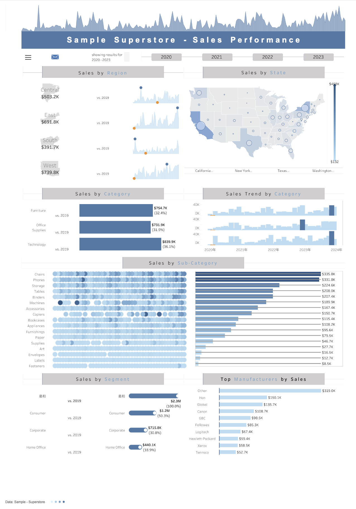

# Superstore Sales Performance Insight Dashboard

Welcome to the GitHub repository for the "Superstore Sales Performance Insight Dashboard" developed in Tableau. This dashboard is designed to provide a comprehensive analysis of sales performance across various dimensions of a superstore's operations. It offers interactive visualizations that allow users to delve into sales data by region, state, category, sub-category, segment, and manufacturer.

## Features

- **Multi-Dimensional Analysis**: Explore sales performance through various lenses including region, state, category, sub-category, segment, and manufacturer to identify trends and patterns.
- **Interactive Visualizations**: Each chart and graph is interactive, enabling users to click on elements such as region, state, and others to filter and drill down into more specific insights.
- **Yearly Trends**: Users can filter the entire dashboard based on the year to analyze how sales performance has evolved over time.
- **Comprehensive Dashboard**: Combines multiple types of charts and graphs to showcase sales data, making it easy to compare and contrast different aspects of sales performance.

## Using the Dashboard

To interact with the dashboard:
1. **Select a Dimension**: Click on any dimension like region, state, category, etc., on the charts to filter the entire dashboard based on that selection.
2. **Choose a Year**: Use the year filter to narrow down the sales data to a specific year for focused analysis.
3. **Explore Trends**: Hover over any chart element to see detailed data points and insights.

## Purpose

The purpose of this dashboard is to empower superstore managers, sales analysts, and decision-makers with actionable insights into sales performance. By analyzing sales across different dimensions and over time, users can identify successful strategies, areas for improvement, and emerging trends.

## Inspiration

This dashboard was inspired by [Pradeep Kumar G's Sample Superstore - Sales Performance](https://public.tableau.com/app/profile/pradeepkumar.g/viz/SampleSuperstore-SalesPerformance/viz_) on Tableau Public. It has been reproduced using the latest data to provide fresh insights and perspectives.

